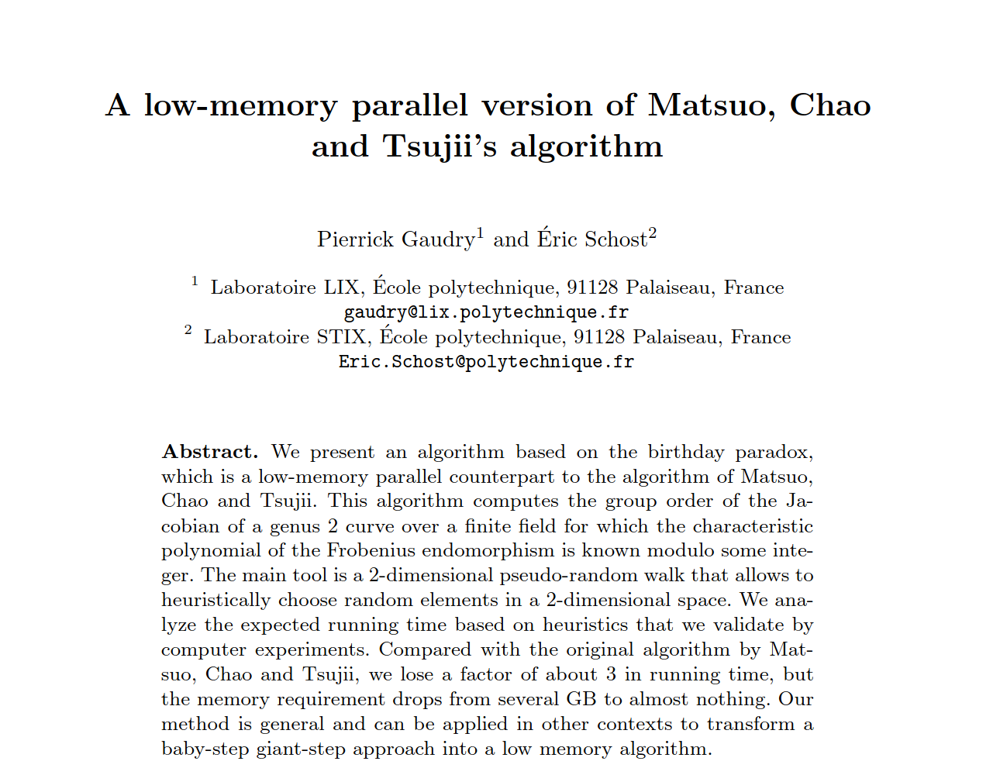

# Unofficial LeetArxiv Implementation of the 2004 paper A Low-Memory Parallel Version of Matsuo, Chao and Tsujii’s Algorithm



The original paper was designed around point counting algorithms for algebraic curves.

Our implementation's goal is to test the author's thesis: **their algorithm  (Gaudry-Schost) can detect collisions in arbitrary finite fields.**

# Getting Started

```
git clone https://github.com/MurageKibicho/Gaudry-Schost-Collision-Algorithm.git
cd Gaudry-Schost
```

## Python

Online Google Colab is available [here](https://colab.research.google.com/drive/1KwZCTxTjaEwmWQZVE02ExhDFS7p9rA9w?usp=sharing)

Run locally `Gaudry-Schost/Gaudry_Schost.ipynb`
```
jupyter notebook
```

## C

### Birthday Paradox 

This requires LibGMP

```
clear && gcc BirthdayAttack.c -lgmp -lm -lmpfr -o g.o && ./g.o
```

### Ball Paradox

This has zero special requirements

```
 clear && gcc BallParadox.c -lm -o g.o && ./g.o
```


Complete Walkthrough available [here](https://leetarxiv.substack.com/p/gaudry-schost-collision-algorithm)
